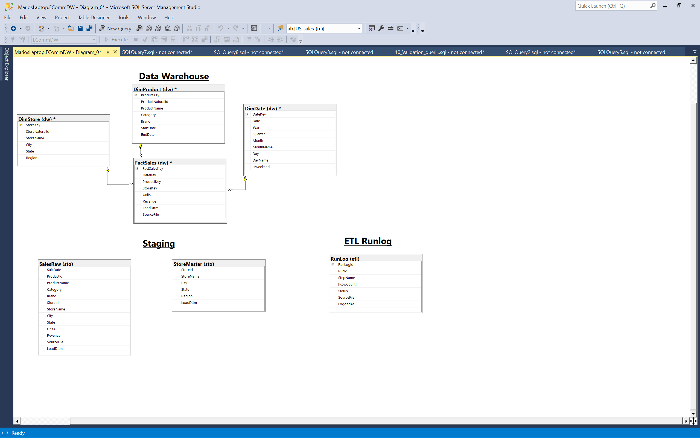
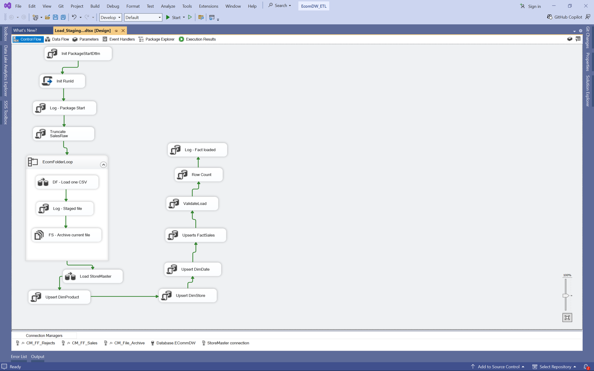
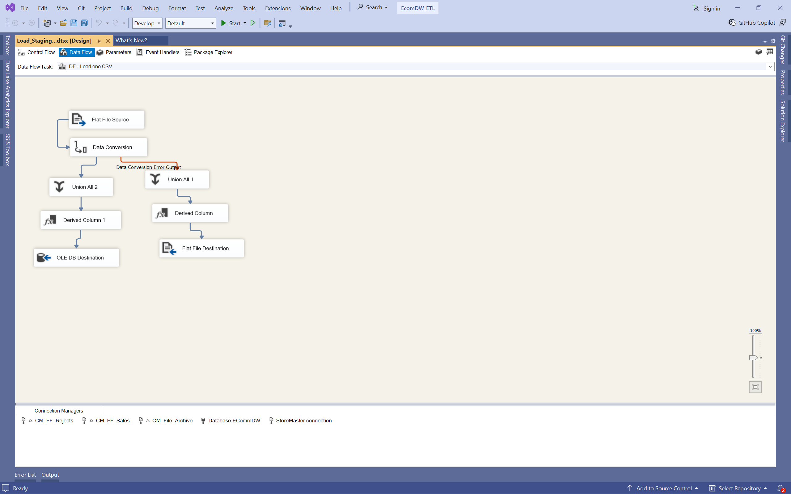
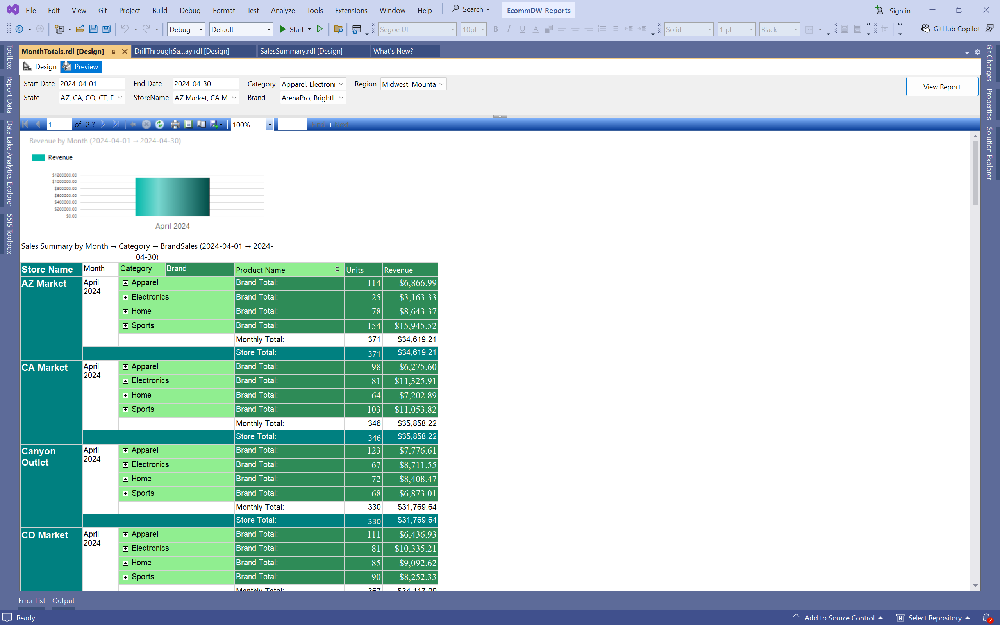
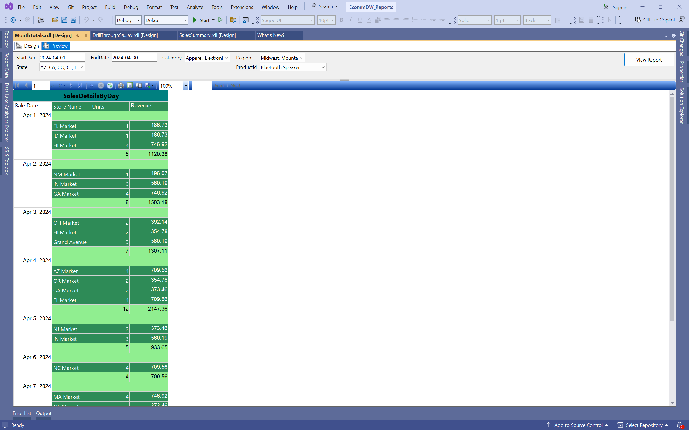

# E-Commerce Data Warehouse & ETL Pipeline

End-to-end data engineering project that simulates an e-commerce analytics pipeline using **Python, SQL Server, SSIS, and SSRS**.

The project generates synthetic sales data, loads it through an ETL pipeline, builds a dimensional data warehouse, and produces analytical reports.

---

# Architecture Overview

This project implements a **star schema data warehouse** with staging, transformation, and reporting layers.

---

# Technology Stack

Python :
Synthetic sales data generation

SQL Server : 
Data warehouse,
Dimensional modeling,
Stored procedures and validation

SSIS : 
ETL orchestration,
Data transformation and Surrogate key resolution

SSRS :
Analytical reporting and Interactive dashboards

---

# Data Pipeline

The pipeline simulates a typical enterprise data engineering workflow.

1. Python generates synthetic sales data.
2. Data is exported to CSV files.
3. SSIS ingests CSV files into staging tables.
4. Staging views perform deduplication and validation.
5. Dimension tables are upserted using surrogate keys.
6. Fact table loads transactional metrics.
7. SSRS reports provide analytical insights.

---

# SSIS ETL Pipeline

The SSIS control flow orchestrates ingestion and warehouse loading.

---

# Data Transformation

SSIS data flows perform transformations including:

-type conversions,

-lookup transformations,

-derived columns and surrogate key resolution.

---

# Dimensional Data Warehouse

The warehouse follows a **star schema design**.

### <ins>Fact Table

**FactSales :**
Units,
Revenue,
DateKey,
ProductKey and StoreKey

### <ins>Dimension Tables

**DimDate :**
Date attributes for time analysis

**DimProduct :**
Product hierarchy and attributes

**DimStore :**
Store location and region attributes

---

# Reporting Layer

SSRS provides analytical reporting with filtering and drill-through capability.

## Sales Summary Report

## Drillthrough Detail Report

---

## Data Validation

**Validation scripts ensure pipeline integrity by checking:**

- row counts across pipeline stages

- null dimension keys

- outlier unit prices

- referential integrity

---

## Future Improvements

**Potential enhancements include:**

- incremental loading

- automated scheduling

- additional reporting metrics

- data quality monitoring

---

# Author

Mario Herrera
